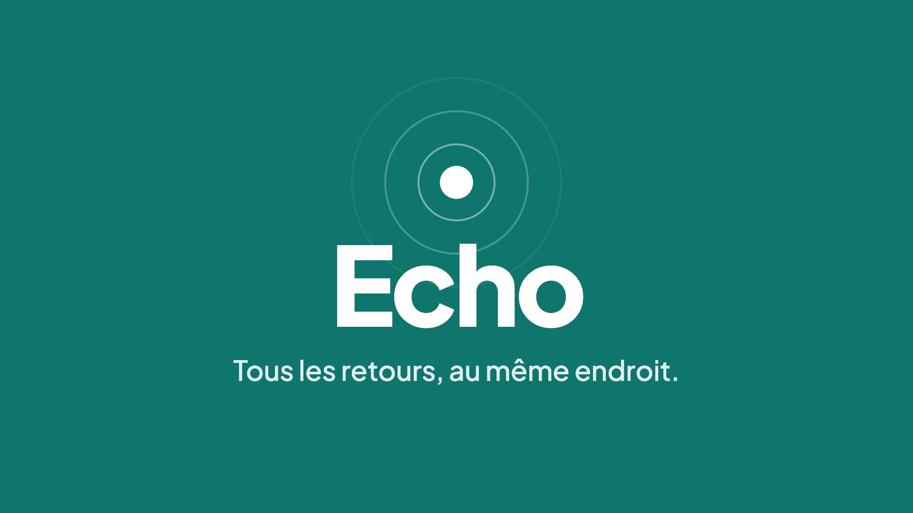
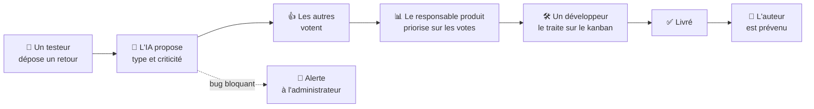
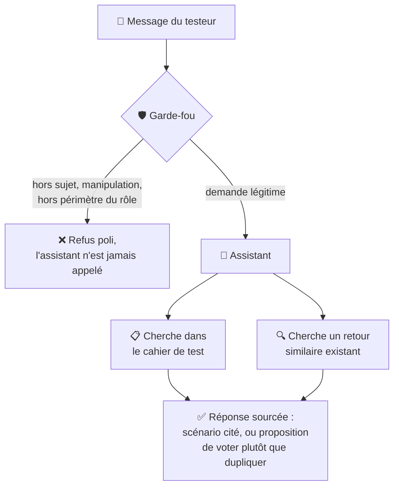
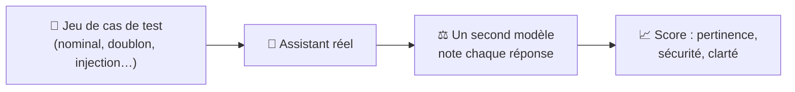
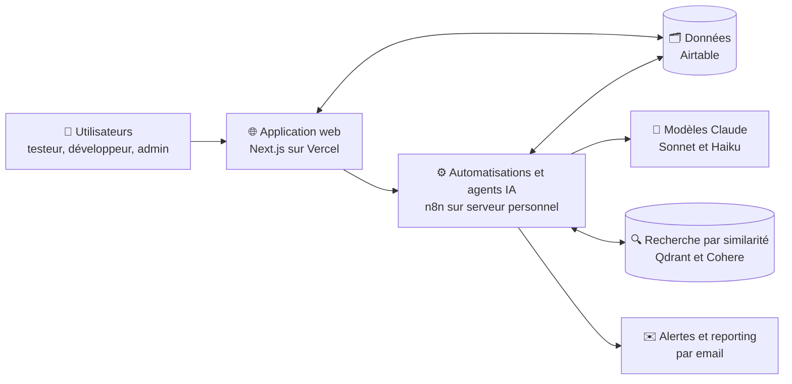
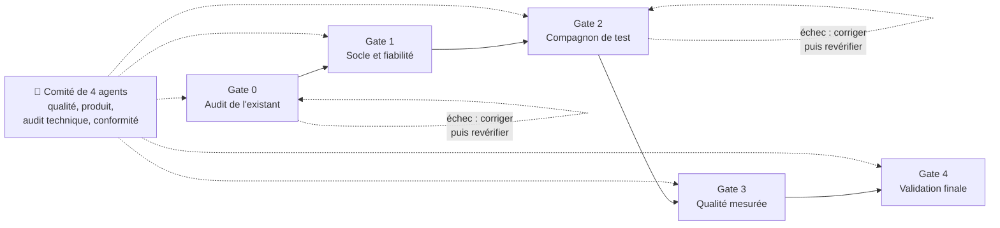
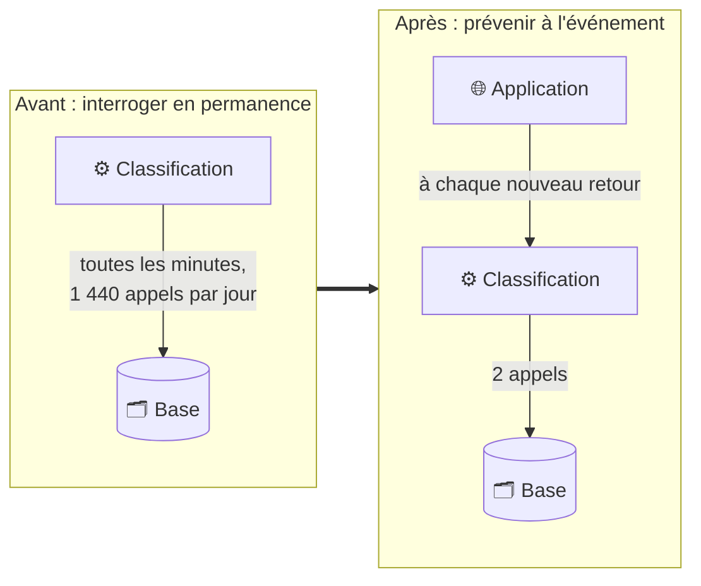
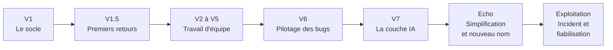

# Echo

**Centraliser, prioriser, orienter le feedback produit.**

Echo est une application web qui rassemble au même endroit les retours des utilisateurs internes d'une entreprise (bugs, idées, améliorations). Chacun vote pour ce qui compte vraiment pour lui, et l'équipe produit priorise sur des données plutôt qu'à l'instinct. Une couche d'intelligence artificielle classe les retours, accompagne les testeurs et produit un reporting automatique.

🌐 **Application en ligne** : [echo.vincentgranouillit.com](https://echo.vincentgranouillit.com)
🎬 **Vidéo de présentation (une minute)** : sur la page d'accueil de l'application

> Ce dépôt présente le projet : le besoin, ce qui a été construit, comment et avec quelle méthode. Le code source et la documentation technique détaillée sont conservés dans un dépôt privé. Accès possible sur demande, dans le cadre d'un échange professionnel.

---

## Sommaire

1. [Le problème](#le-problème)
2. [Ce que fait Echo](#ce-que-fait-echo)
3. [La couche IA](#la-couche-ia)
4. [Comment c'est construit](#comment-cest-construit)
5. [Ma méthode : je pilote, l'IA code, un comité contrôle](#ma-méthode--je-pilote-lia-code-un-comité-contrôle)
6. [Sécurité, qualité, accessibilité](#sécurité-qualité-accessibilité)
7. [En exploitation : l'incident de septembre 2026](#en-exploitation--lincident-de-septembre-2026)
8. [Versions : une construction itérative](#versions--une-construction-itérative)
9. [Et après](#et-après)

---

## Le problème

Dans une entreprise, les retours sur un outil interne arrivent de partout : messagerie, mails, réunions, tickets. Trois conséquences reviennent toujours.

- On priorise **à l'instinct**, et c'est souvent celui qui insiste le plus qui obtient gain de cause.
- Les mêmes demandes sont **remontées plusieurs fois**, parce que personne ne sait ce qui a déjà été signalé.
- L'équipe produit n'a **aucun signal fiable** sur ce qui gêne réellement le plus de monde.

**La cible** : les clients internes d'une entreprise (collaborateurs qui utilisent un outil et le testent), l'équipe de développement qui corrige, et le responsable produit qui arbitre.

## Ce que fait Echo

Trois profils, trois usages.

**Le testeur ou l'utilisateur**
- Dépose un retour structuré (titre, description, type). Pour un bug, il indique sa criticité à partir d'une question simple : « peut-on quand même utiliser l'application ? ».
- Vote pour les retours des autres, une seule fois par retour. La liste se trie d'elle-même par nombre de votes : les vraies priorités remontent seules.
- Suit un **cahier de test** de la campagne en cours, et peut donner un retour directement depuis un scénario.
- Est prévenu quand son retour avance, et peut échanger en commentaires.

**Le développeur**
- Travaille sur un **tableau kanban** (à faire, en cours, en revue, livré) avec les retours qui lui sont attribués.

**L'administrateur ou le responsable produit**
- Dispose d'un **tableau de bord** : indicateurs clés, répartition par type, backlog par statut, bugs bloquants à traiter en priorité, principaux contributeurs.
- Peut reclasser la criticité d'un bug, modérer, exporter l'ensemble des retours.
- Reçoit des **alertes** quand un bug bloquant est signalé ou quand un sujet décolle en votes.
- Reçoit un **reporting automatique** : une synthèse des sujets qui montent, des bugs critiques et une recommandation.

Et pour tous : mode clair et sombre, interface utilisable au clavier et avec un lecteur d'écran.

**Le parcours d'un retour, de bout en bout**

## La couche IA

L'IA reste au service de la boucle principale (déposer, voter, prioriser) et n'en est jamais une dépendance : si elle tombe, l'application continue de fonctionner.

| Fonction | Ce qu'elle apporte |
|---|---|
| **Classification automatique** | Chaque nouveau retour reçoit une proposition de type et de criticité. Un arbitrage fait par un administrateur n'est jamais écrasé par l'IA. |
| **Compagnon de test** | Un assistant conversationnel intégré à l'application. Il oriente le testeur vers le bon scénario du cahier de test et repère un retour similaire déjà existant, pour proposer de voter plutôt que de créer un doublon. |
| **Garde-fou** | Chaque message adressé au Compagnon est d'abord filtré : hors sujet, tentative de manipulation ou demande hors du périmètre du rôle de l'utilisateur sont refusés avant même d'atteindre l'assistant. |
| **Reporting automatique** | Une synthèse rédigée des retours de la période, envoyée au responsable produit. |
| **Qualité mesurée** | Un jeu de cas de test (cas nominal, doublon, hors sujet, tentative d'injection, hors périmètre, information absente) est rejoué contre l'assistant réel, puis chaque réponse est notée par un second modèle sur la pertinence, la sécurité et la clarté. |

**Résultat de référence** : **4,96 sur 5** en moyenne, sur 8 cas sur 8 exécutés sans erreur (pertinence 4,88, sécurité 5, clarté 5).

Le Compagnon s'appuie sur une recherche par similarité de sens (RAG) dans le cahier de test et dans les retours existants : il répond à partir de sources réelles, cite le scénario concerné, et dit honnêtement quand il ne trouve rien.

**Comment le Compagnon traite un message**

**Comment la qualité est mesurée**

## Comment c'est construit

Une architecture en quatre briques, chacune choisie pour une raison précise.

| Brique | Outil | Pourquoi |
|---|---|---|
| Application web | **Next.js** et **TypeScript**, hébergée sur **Vercel** | Une seule base de code pour l'interface et le serveur, déploiement continu à chaque mise à jour |
| Données | **Airtable** | Démarrage rapide, lisible sans compétence technique, adapté au volume d'une équipe |
| Automatisations et agents IA | **n8n**, hébergé sur mon propre serveur | Les workflows IA s'ajustent sans redéployer l'application ; infrastructure dont je reste propriétaire |
| Recherche par similarité | **Qdrant** (auto-hébergé) et **Cohere** (vectorisation multilingue) | Le RAG du Compagnon, sur un corpus en français |
| Modèles de langage | **Claude Sonnet** et **Claude Haiku** (Anthropic) | Le modèle le plus capable pour le dialogue ; un modèle rapide et économe pour les tâches courtes et répétitives (filtrage, classification, notation) |

Principe directeur : **les secrets ne quittent jamais le serveur**, et toute vérification de droits se fait côté serveur, jamais seulement dans l'interface.

## Ma méthode : je pilote, l'IA code, un comité contrôle

Je ne suis pas développeur. Le code de l'application a été écrit par une IA (Claude Code), sous mon pilotage : je définis le besoin, les priorités et les critères d'acceptation, je relis le résultat dans un vrai navigateur, et je donne seul le feu vert avant toute mise en ligne.

Pour ne pas faire confiance aveuglément, j'ai ajouté une **gouvernance par étapes de validation** (« gates »), tenue par un comité de quatre agents indépendants aux rôles distincts : qualité, produit, audit technique, conformité. Chacun doit citer ses preuves. Un seul avis défavorable bloque l'étape.

Ce que ce dispositif a réellement trouvé :

- **Gate 0, audit de l'existant** : 7 écarts majeurs, **dont 3 failles de sécurité** (une injection dans une requête de base de données, la possibilité de deviner si un email avait un compte, une injection de formule dans l'export tableur). Tous corrigés avant d'écrire une ligne de plus.
- **Gate 2, Compagnon de test** : échec au premier passage. L'adresse d'appel de l'assistant n'était pas protégée, et une erreur réelle n'avait déclenché aucune alerte. Corrigé, puis revérifié en conditions réelles.
- **Gates 1, 3 et 4** : validés, avec des écarts mineurs corrigés dans la foulée.
- En vérifiant le tableau de bord dans un vrai navigateur, un bug d'affichage des graphiques (sans rapport avec l'IA) a été trouvé et corrigé.

Tout est vérifié par de vraies exécutions, jamais par simulation.

## Sécurité, qualité, accessibilité

**Sécurité**
- Authentification par session signée, stockée dans un cookie inaccessible au code du navigateur.
- Droits vérifiés sur le serveur pour chaque action : modifier le retour d'un autre, accéder à l'administration ou voter deux fois est refusé, même en contournant l'interface.
- L'assistant IA ne fait jamais confiance à l'identité déclarée dans un message : elle est relue depuis la session.
- Tests d'attaque manuels réalisés sur chacun de ces points.

**Qualité**
- Tests de bout en bout automatisés sur les parcours critiques (inscription, connexion, vote, anti double vote, permissions, kanban).
- Intégration continue : chaque mise à jour du code est vérifiée (typage, règles de style, compilation).

**Accessibilité**
- Cible **WCAG 2.1 AA** : audit interne passé, correctifs appliqués (focus visible, lien d'évitement, contrastes, annonces d'erreurs aux lecteurs d'écran, respect de la préférence « réduire les animations »).
- Contrôle automatique à chaque mise à jour : toute violation d'accessibilité sérieuse fait échouer la vérification. Ce contrôle a déjà intercepté une régression de contraste.

## En exploitation : l'incident de septembre 2026

Un produit se juge aussi à la façon dont on traite ses incidents.

**Ce qui s'est passé.** Pour détecter les nouveaux retours, le workflow de classification interrogeait la base de données toutes les minutes, même quand il n'y avait rien de neuf. Le 14 septembre, ces interrogations ont épuisé le quota mensuel d'appels de la base. Chaque échec a alors déclenché le workflow d'alerte, qui a échoué à son tour parce que son accès à la messagerie avait expiré. Résultat : environ 2 140 erreurs en 35 heures, sans qu'aucune alerte n'arrive, jusqu'à la désactivation du workflow le 16 septembre.

**Ce que j'en ai tiré.**
- **Changer de logique** : plutôt que d'interroger la base en permanence, c'est l'application qui prévient l'automatisation à chaque nouveau retour. On passe de 1 440 appels par jour à deux appels par nouveau retour.
- **Blinder les alertes** : au maximum une alerte par heure et par workflow, avec le nombre d'erreurs regroupées. Un workflow d'alerte ne doit jamais pouvoir s'emballer.
- **Surveiller les accès qui expirent** : un accès qui tombe en silence est un point de défaillance à part entière.

## Versions : une construction itérative

Echo n'a pas été construit d'un bloc. Chaque version part de la précédente, en ajoutant ce que l'usage ou les retours ont fait apparaître.

| Version | Quand | Ce qui a été ajouté |
|---|---|---|
| **V1, le socle** | Mai 2026 | Inscription et connexion, dépôt d'un retour (bug, idée, amélioration), vote limité à un par personne, tri automatique par votes, espace d'administration. |
| **V1.5, premiers retours** | Mai 2026 | Page d'accueil, liste réservée aux personnes connectées, filtres par type, messages de confirmation, modification directe d'un retour. |
| **V2 à V5, travail d'équipe** | Mai 2026 | Rôle développeur et tableau kanban, notifications à l'auteur, commentaires, tableau de bord avec graphiques, vérification de l'email et mot de passe oublié, mode sombre (le retour le plus voté du jeu de données), tests automatisés et accessibilité. |
| **V6, pilotage des bugs** | Mai 2026 | Criticité des bugs avec reclassement par l'administrateur, bugs bloquants mis en avant sur le tableau de bord, alertes automatiques, export tableur, suppression réversible, contrôle d'accessibilité à chaque mise à jour, nouvelle charte graphique. |
| **V7, la couche IA** | Août 2026 | Audit de l'existant et corrections, classification automatique, cahier de test, Compagnon de test avec garde-fou et recherche par similarité, reporting automatique, mesure de la qualité. |
| **Echo** | Août 2026 | Navigation simplifiée (un seul chemin pour déposer un retour), correctif du mode sombre, renommage du produit (Pulse devient Echo), nouveau jeu de données de démonstration. |
| **Exploitation** | Septembre 2026 | Incident de quota analysé et corrigé, alertes protégées contre l'emballement, vidéo de présentation sur la page d'accueil. |

## Et après

- Finaliser la mise en production du nouveau déclenchement de la classification.
- Calibrer le juge IA en comparant ses notes à un jugement humain.
- Explorer une base de données relationnelle (PostgreSQL) pour gagner en robustesse à plus grande échelle.
- Gérer plusieurs projets dans une même instance, avec des comptes créés sur invitation.

---

Conçu et piloté par **Vincent Granouillit** ([@VincentG32](https://github.com/VincentG32)), code écrit avec Claude Code.
